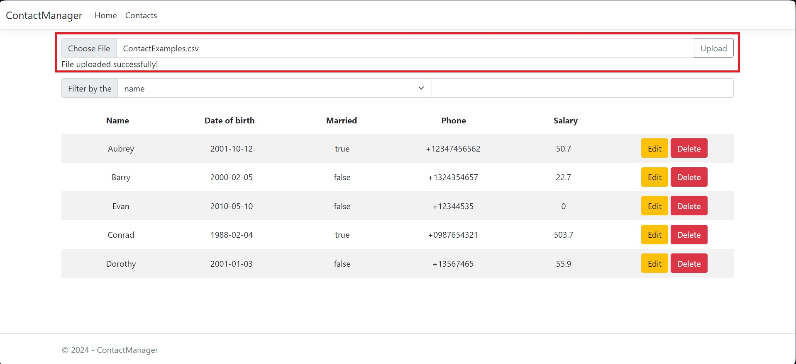
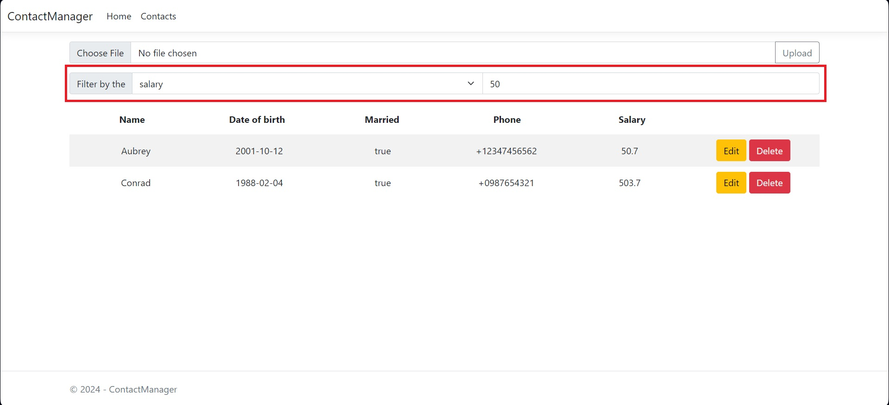
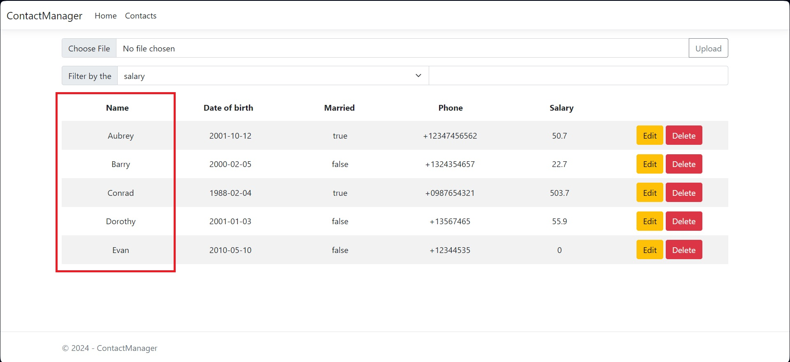
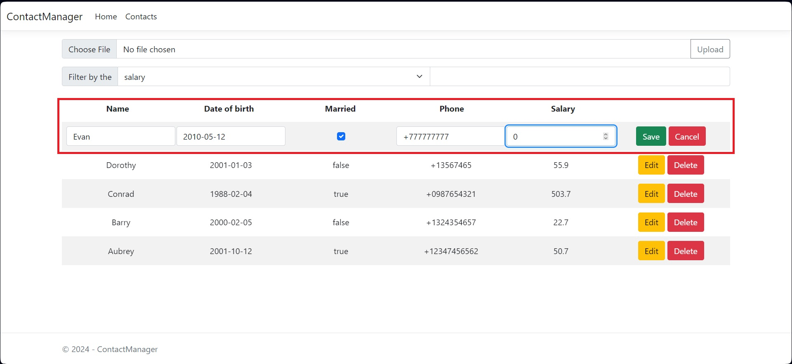
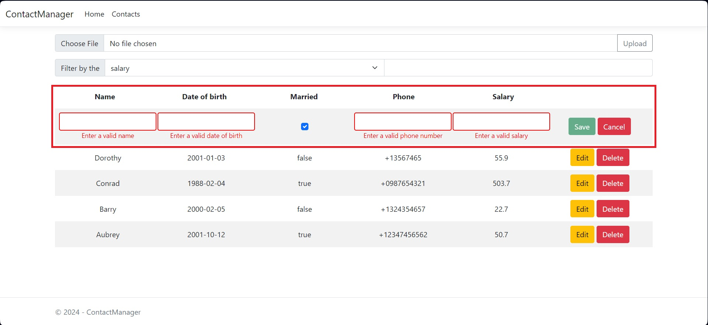
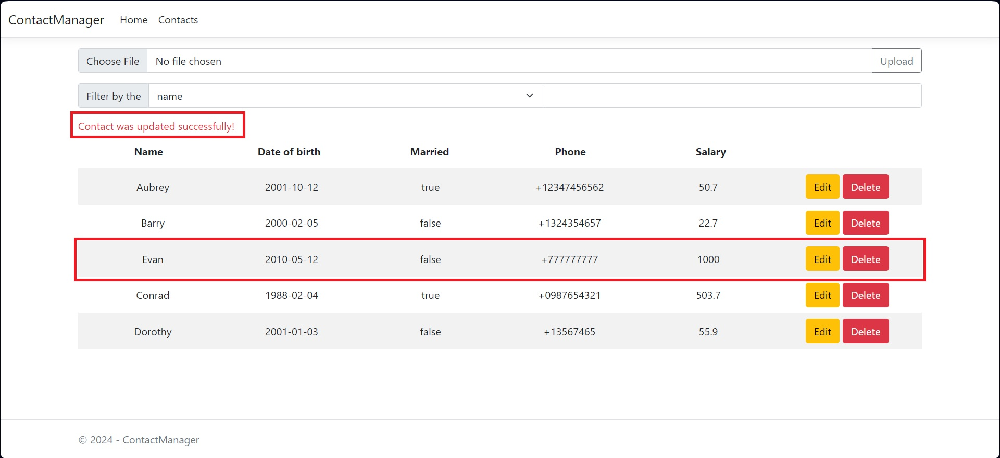
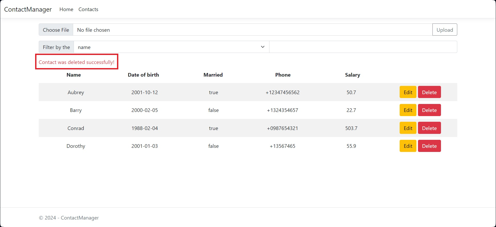

# ContactManager
.NET web application that allow users to upload CSV file with the field below, store data into MS SQL database, and show stored data on the page.

## Usage
* Upload a csv file with contacts containing fields such as: Name, DateOfBirth, Married, Phone, Salary. After that, the contacts will be saved in the database and loaded into the viewer. Examples for testing are provided in the ContactExamples.csv file.

* You can filter contacts by any field. Just select the field and enter the data to filter.

* You can also sort contacts by any field. Simply click on the field name at the top of the table to sort your contacts by this criterion in ascending order.

* If you want sort contacts in the descending order, simply click on the field name at the top of the table one more time.

* You can also edit contacts by clicking on the “Edit” button.

* Fields for editing are also validated on the front-end side.

* The result of editing will be displayed above the table.

* You can also delete contacts by clicking on the "Delete" button. The result of deleting also will be displayed above the table.

## Built with 
* [![Dotnet][Dotnet.com]][Dotnet-url]
* [![Blazor][Blazor.com]][Blazor-url]
* [![Bootstrap][Bootstrap.com]][Bootstrap-url]
* [![AngularJs][AngularJs.org]][Bootstrap-url]

<!-- MARKDOWN LINKS & IMAGES -->
[Dotnet.com]: https://img.shields.io/badge/.NET-512BD4?style=for-the-badge&logo=dotnet&logoColor=white
[Dotnet-url]: https://dotnet.microsoft.com
[Blazor.com]: https://img.shields.io/badge/Blazor-512BD4?style=for-the-badge&logo=blazor&logoColor=white
[Blazor-url]: https://dotnet.microsoft.com/en-us/apps/aspnet/web-apps/blazor
[Bootstrap.com]: https://img.shields.io/badge/Bootstrap-563D7C?style=for-the-badge&logo=bootstrap&logoColor=white
[Bootstrap-url]: https://getbootstrap.com
[Angularjs.org]: https://img.shields.io/badge/angular.js-%23E23237.svg?style=for-the-badge&logo=angularjs&logoColor=white
[AngularJs-url]: https://angularjs.org